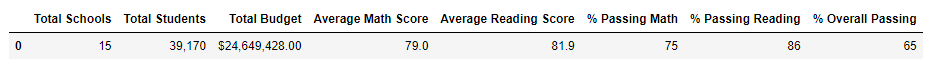
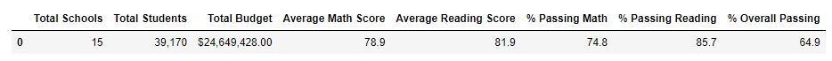
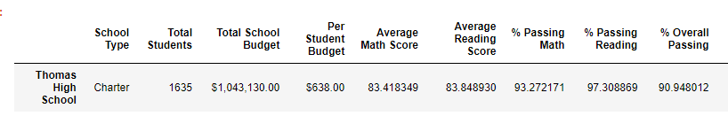
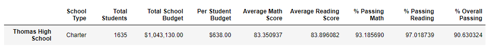
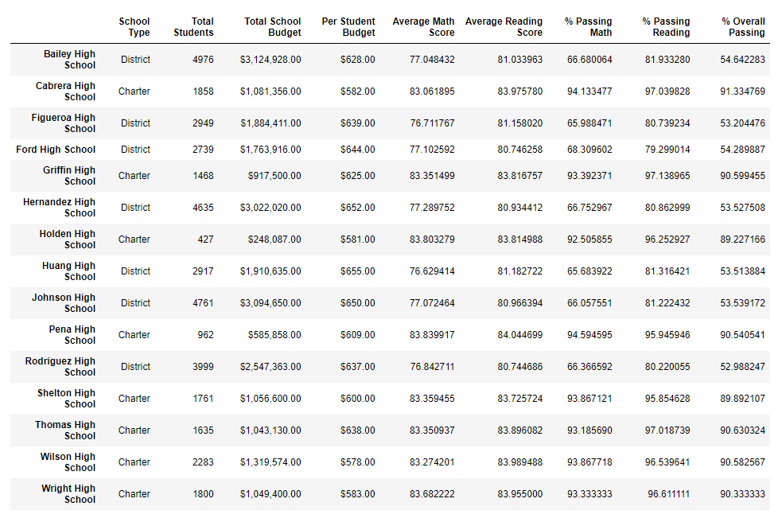

# School_District_Analysis
---
## Overview
---
Maria, chief data scientist for city school district, hired me to run analysis on multiple high schools. She was interested to know how their reading and math passing percentages were effected by the type of school (charter or district), spending budget per student, and grade. Once all of this analysis was completed, Maria was notified by the school board that there was strong evidence of academic dishonesty among the ninth grade class of Thomas High School. After the news, Maria asked that I complete my analysis again, but this time excluding that particular class' scores. I was then asked to compare my new findings to the previous ones.   

## Results
---
- ### How is the district summary affected?  
Overall I found that the district summary was largely unaffected by the subtraction of the ninth grade students' scores from Thomas High. This is due to the fact that the class numbered 461 students. Total number of students across all 15 school districts I was asked to analyze was 39,170 students. Ninth grade class size at Thomas High equalled about 1 percent of the total number of students.   

*Table 1: District summary with Thomas High School ninth grade class scores included.*   

*Table 2: District summary with Thomas High School ninth grade class scores omitted.*     

- ### How is school summary affected?  
The school summary was affected very little, which makes sense. Tenth through twelfth grade classes operate independently of the ninth grade class. We are now only looking at the tenth through twelfth grade classes. The scores from the ninth grade class were not changed to zero, but rather the class was omitted from the calculations altogether.   

*Table 3: School summary including scores and percentages for ninth grade class at Thomas High School.*   

*Table 4: Updated school summary showing only tenth through twelfth grade class performance scores.*    

- ### How does replacing the ninth graders' math and reading scores affect Thomas High School's performance relative to other schools?   
It effects the ranking of Thomas High School very little. Students in grades ten through twelve performed very well in math and reading.   

   

- ### How does replacing the ninth-grade scores affect the following:   

    - ### Math and reading scores by grade  
    Thomas High School ninth grade scores are no longer in the running in comparison to other schools. All other grade scores are unaffected.   

    - ### Scores by school spending  
    No effect.  

    - ### Scores by school size  
    No effect.  

    - ### Scores by school type  
    No effect.   

## Summary
---

After replacing the Thomas High ninth grade's reading and math scores with "NaN" in the datasets, I had very few changes to report to Maria. Thomas High's passing percentages for math and reading were altered by fractions of a percent. In the overall district summary I got the same findings. I could no longer rank Thomas High against the other schools' ninth grade classes, but the other grades were highly competitive with other schools in the region. 

